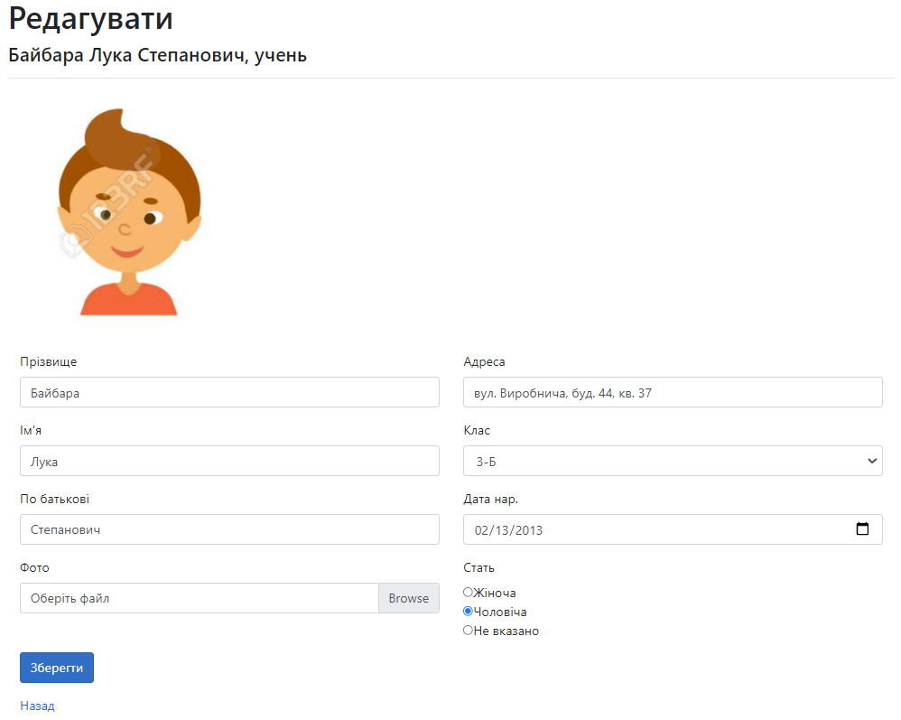
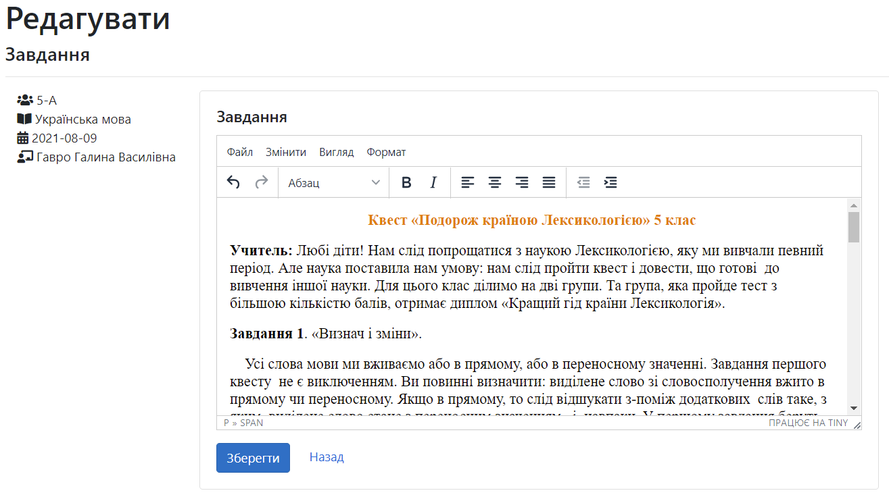
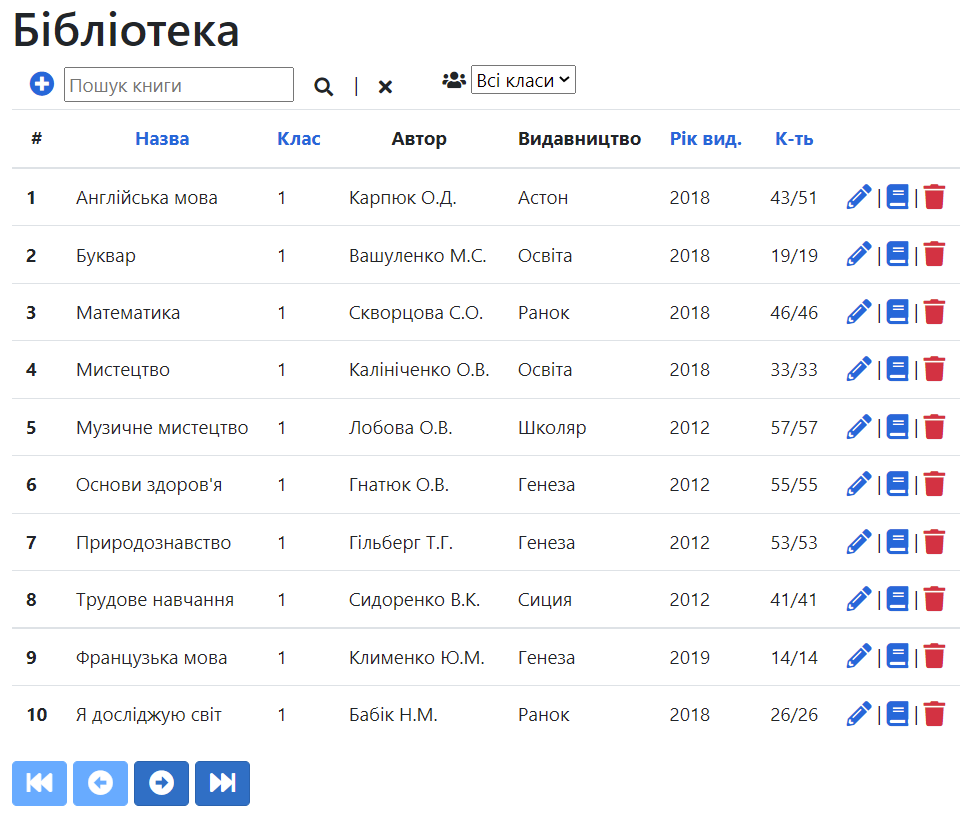
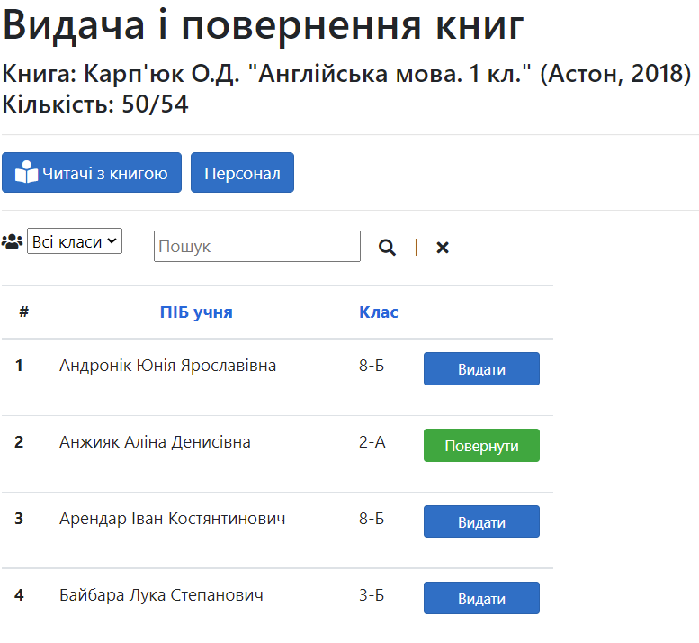
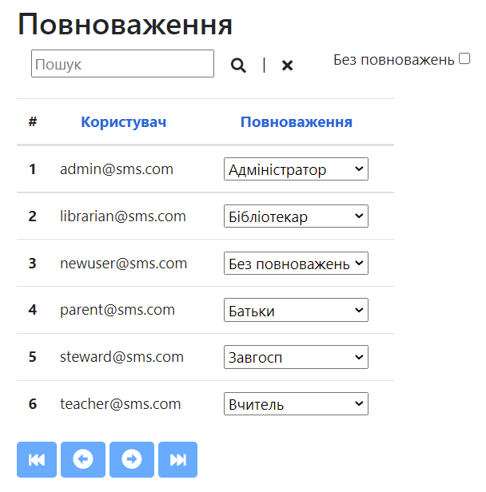

School Management System<br />
==============================
Features:<br />
---------------
- Manage students, teachers
- Manage curriculum, subjects
- Manage and generate timetable
- Manage library
- Manage school utensils and inventory
- Manage remote assignments
- Manage students' progress and attendance

Installation:<br />
---------------
Written in ASP.NET Core with Entity Framework Core and SQL Server.<br />
To create database, type in Package Manager Console (Visual Studio):<br />
`Update-Database`<br /><br />
Users are:
```
1@1.com
steward@sms.com
parent@sms.com
admin@sms.com
librarian@sms.com
teacher@sms.com
```
Password is:<br />
`aA!111`

Admin can view all pages and change any data.

Система управління школою:<br />
---------------------------------
- Управління учнями, вчителями
- Управління навчальним планом, предметами
- Складання, редагування та автоматична генерація розкладу
- Видача та облік книг бібліотеки
- Завдання для дистанційного навчання
- Моніторинг навчальних досягнень учнів і класів

<br /><br />
<br /><br />
<br /><br />
<br /><br />
<br /><br />
<br /><br />
<br /><br />
<br /><br />
<br /><br />
<br /><br />
<br /><br />
<br /><br />
<br /><br />
<br /><br />
<br /><br />
<br /><br />
<br /><br />