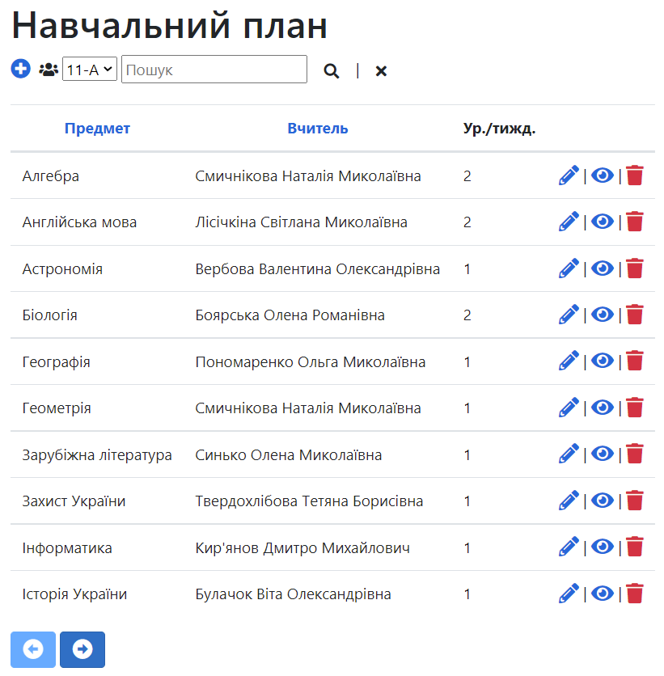
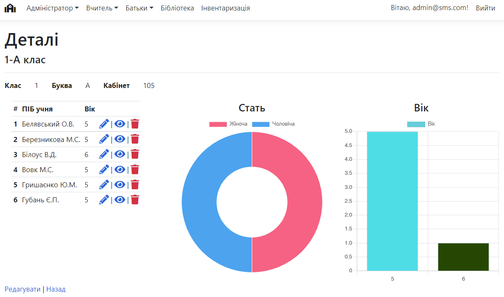
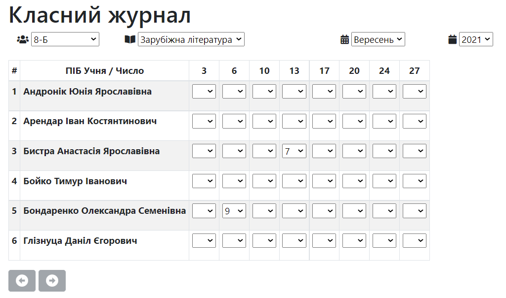
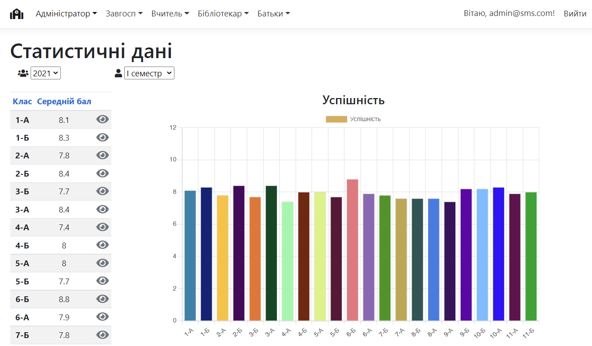
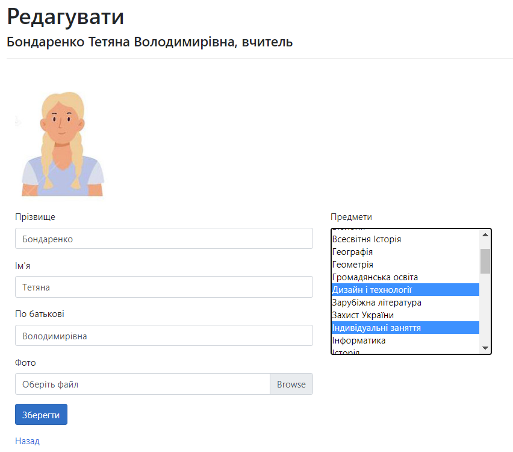
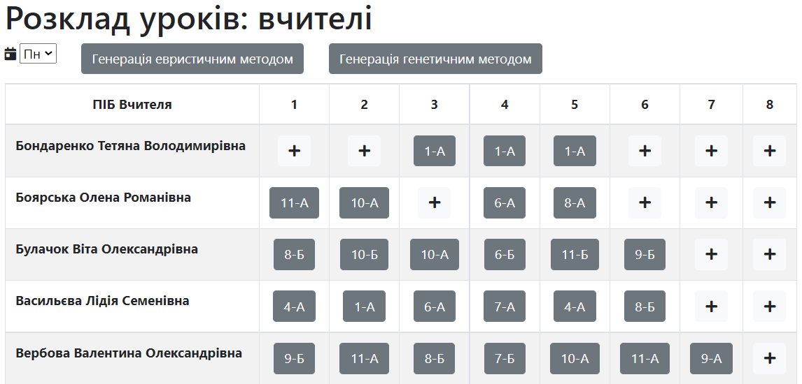
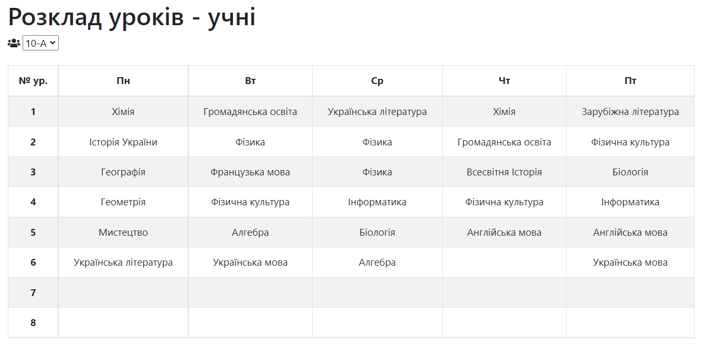

School Management System 
==============================
Features: 
---------------
- Manage students, teachers
- Manage curriculum, subjects
- Manage and generate timetable
- Manage library
- Manage school utensils and inventory
- Manage remote assignments
- Manage students' progress and attendance

Система управління школою: 
---------------------------------
- Управління учнями, вчителями
- Управління навчальним планом, предметами
- Складання, редагування та автоматична генерація розкладу
- Видача та облік книг бібліотеки
- Завдання для дистанційного навчання
- Моніторинг навчальних досягнень учнів і класів

  
  
  
  
  
  
  
  
  
  
  